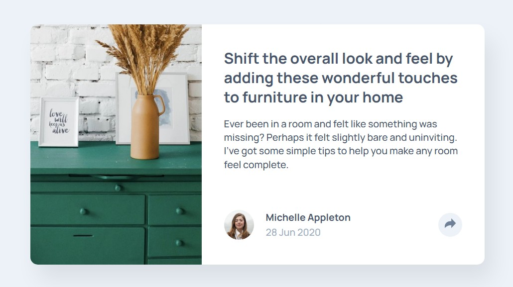

# Frontend Mentor - Article preview component solution

This is a solution to the [Article preview component challenge on Frontend Mentor](https://www.frontendmentor.io/challenges/article-preview-component-dYBN_pYFT). Frontend Mentor challenges help you improve your coding skills by building realistic projects.

## Table of contents

- [Overview](#overview)
  - [The challenge](#the-challenge)
  - [Links](#links)
- [My process](#my-process)
  - [Built with](#built-with)
  - [What I learned](#what-i-learned)
  - [Continued development](#continued-development)
  - [Useful resources](#useful-resources)
  - [AI Collaboration](#ai-collaboration)
- [Author](#author)

## Overview

### The challenge

Users should be able to:

- View the optimal layout for the component depending on their device's screen size
- See the social media share links when they click the share icon


### Screenshot



### Links

- Solution URL: [Repository](https://github.com/jonghwascript/article-preview-component.git)
- Live Site URL: [Live site](https://jonghwascript.github.io/article-preview-component)

## My process

### Built with

- Semantic HTML5 markup
- CSS custom properties
- Flexbox
- CSS Grid
- Mobile-first workflow
- Vanilla JavaScript (DOM manipulation, no framework)

### What I learned

**1. A fixed `height` on a responsive image fights `aspect-ratio`**

The design file listed the mobile image height as `200px`, so it was set directly alongside `aspect-ratio`:

```css
.preview-card__image {
  width: 100%;
  height: 200px;
  aspect-ratio: 660 / 528;
}
```

Per the CSS spec, `aspect-ratio` is ignored once both `width` and `height` resolve to non-`auto` values — so it was dead code here. Combined with no `object-fit` on the ``, shrinking the card on narrow viewports kept the height locked at `200px` while the width shrank, stretching the image. The `200px` in the design is the *result* of a 327px-wide card, not a value to hard-code for every viewport. Fix:

```css
.preview-card__image {
  width: 100%;
  aspect-ratio: 660 / 528;
  object-fit: cover;
}
```

**2. `width: 100%; max-width: 327px;` needs a floor on very narrow viewports**

This pattern correctly caps the card at the design width while letting it shrink on smaller screens — but with no padding anywhere in the ancestor chain, a viewport narrower than 327px (e.g. 320px) makes `width: 100%` win over `max-width`, so the card touches the screen edges. Adding a small inline padding to the page container keeps a minimum gutter:

```css
.continer {
  padding-inline: 16px;
}
```

**3. Recoloring an SVG icon with CSS**

For an icon that needs to change color on interaction (e.g. on `:hover` or a toggled `.active` class), inlining the `<svg>` directly in the HTML is the most flexible approach — its `fill` can then be overridden from the stylesheet instead of being baked into an image file:

```html
<svg xmlns="http://www.w3.org/2000/svg" width="15" height="13">
  <path fill="#6E8098" d="..." />
</svg>
```

```css
.preview-card__share-btn--active path {
  fill: var(--white-bg);
}
```

**4. Building a speech-bubble arrow with the CSS border trick**

```css
.preview-card__share-pop::after {
  content: "";
  position: absolute;
  top: 100%;
  border: 8px solid transparent;
  border-top-color: var(--Grey-900);
}
```

Giving all four borders equal width on a `0×0` box makes each border render as a triangle (adjacent border edges meet at a 45° miter). Coloring only `border-top` and leaving the rest transparent leaves just that triangle visible — flat edge on top, point at the bottom — which is exactly the downward-pointing tail a popover needs. `top: 100%` places it flush under the popover, pointing at the button below.

**5. `overflow: hidden` on a parent clips more than you intend**

`.preview-card` used `overflow: hidden` to clip the image's top corners to the card's `border-radius`. Once the share popover needed to render *outside* the card bounds (floating above the button on tablet/desktop), that same rule clipped the popover too. The fix was to stop relying on the parent for corner-rounding and let the image round its own corners instead:

```css
.preview-card {
  overflow: visible; /* at the tablet/desktop breakpoint */
}

.preview-card__image {
  border-radius: 10px 0 0 10px; /* rounds itself, independent of the parent */
}
```

**6. `HTMLCollection` has no `addEventListener`**

```js
// Wrong: getElementsByClassName returns a live HTMLCollection, not an element
const shareBtn = document.getElementsByClassName("preview-card__share-btn");
shareBtn.addEventListener("click", ...); // TypeError

// Fixed
const shareBtn = document.querySelector(".preview-card__share-btn");
```

**7. Don't nest the popover inside the toggle `<button>`**

Nesting the share popover directly inside the `<button>` seemed convenient for positioning, but caused two real problems: clicks on the links *inside* the popover bubbled up to the button's own click handler and immediately closed it again, and nesting interactive elements (`<a>` inside `<button>`) is invalid HTML. Wrapping the button and the popover in a sibling container instead (`.preview-card__group`) fixed both issues and, as a bonus, gave the popover a small, predictably-sized positioning anchor — so it could be centered with `left: 50%; transform: translateX(-50%)` instead of hand-tuned pixel offsets that broke at different viewport widths.

**8. Resetting default `a`/`button` styles removes the interaction affordance, not just the "ugly" default**

```css
a {
  text-decoration: none;
}

button {
  outline: none;
  border: 0;
}
```

These resets left the share links and share button with no `:hover` feedback for mouse users and no visible focus ring for keyboard users tabbing through the page. The fix is to add the states back explicitly instead of just removing the browser default:

```css
.preview-card__share-btn:hover {
  background-color: var(--Grey-500);
}

.preview-card__share-btn:hover path {
  fill: var(--white-bg);
}

.preview-card__icon a:hover {
  opacity: 0.6;
}

button:focus-visible {
  outline: 2px solid var(--Grey-500);
  outline-offset: 2px;
}
```

Using `:focus-visible` instead of `:focus` keeps the outline from flashing on a mouse click while still showing it for keyboard navigation.

**9. `letter-spacing` doesn't accept a `%` value**

```css
.preview-card__tip {
  letter-spacing: 0.12%;
}
```

`letter-spacing` only accepts `normal` or a `<length>` — a percentage isn't a valid value for this property, so the browser drops the whole declaration and falls back to `normal`. The `0.12%` came from copying a design-tool convention (spacing expressed as a percentage of font size) straight into CSS without converting it to a length. Fixed by using `0.12px` instead.

**10. `<time datetime>` needs a machine-readable value, not the display string**

```html
<time datetime="28 Jun 2020">28 Jun 2020</time>
```

The visible text can be formatted however you like, but the `datetime` attribute is what browsers/tools/screen readers parse, and it's expected in ISO 8601 (`YYYY-MM-DD`). Fixed by splitting the two: `datetime="2020-06-28"` with `28 Jun 2020` kept as the human-readable text node.

**11. A requested font weight that doesn't exist just gets faked**

```css
@import url('https://fonts.googleapis.com/css2?family=Manrope:wght@400;500;700&display=swap');

--Text-Preset-1: 900 1.25rem/1.3 var(--font-body);
```

Two text presets used `font-weight: 900`, but the `@import` only requested 400/500/700 — and Manrope's variable range doesn't even go past 800. Since the exact weight isn't available, the browser either snaps to the closest loaded weight or synthesizes a faux-bold, so the heading and author name wouldn't render at the intended thickness. The style guide's heading weights are 500/700, so the presets were changed to `700` to match what's actually loaded rather than adding a weight the font doesn't have.

### Continued development

- Fine-tune spacing/typography against the Figma source for pixel-perfect accuracy (currently eyeballed from the JPG design files).
- Close the share popover on outside click / <kbd>Escape</kbd>, and manage focus for full keyboard accessibility.
- Cross-browser/device testing beyond the primary browser used during development.

### Useful resources

- [MDN — `aspect-ratio`](https://developer.mozilla.org/en-US/docs/Web/CSS/aspect-ratio) — clarified exactly when it's ignored (both dimensions definite).
- [MDN — CSS Grid `grid-template-areas`](https://developer.mozilla.org/en-US/docs/Web/CSS/grid-template-areas) — used for the tablet/desktop two-column layout.
- [MDN — stacking context](https://developer.mozilla.org/en-US/docs/Web/CSS/CSS_positioned_layout/Stacking_context) — needed to reason about why the share popover was rendering over/under other elements.

### AI Collaboration

I used Claude Code throughout this project as a debugging and code-review partner rather than a code generator: describing a symptom (an image stretching, a button that didn't seem to respond, a popover rendering in the wrong place) and working through *why* it was happening before applying a fix. It was most useful for explaining CSS/JS behavior I hadn't internalized yet (aspect-ratio's interaction with definite sizes, stacking contexts, event bubbling) and for catching structural issues (invalid nested interactive HTML, `HTMLCollection` vs. a single element) that produced correct-looking code with a hidden bug.

## Author

- Frontend Mentor - [@jonghwascript](https://www.frontendmentor.io/profile/jonghwascript)
